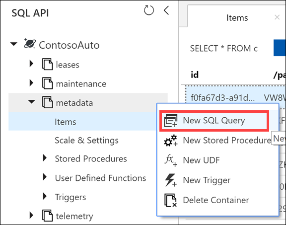
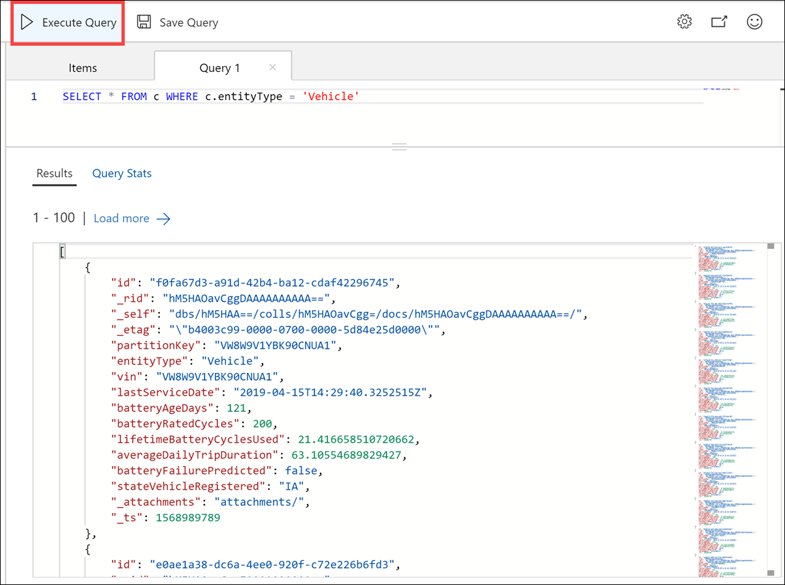
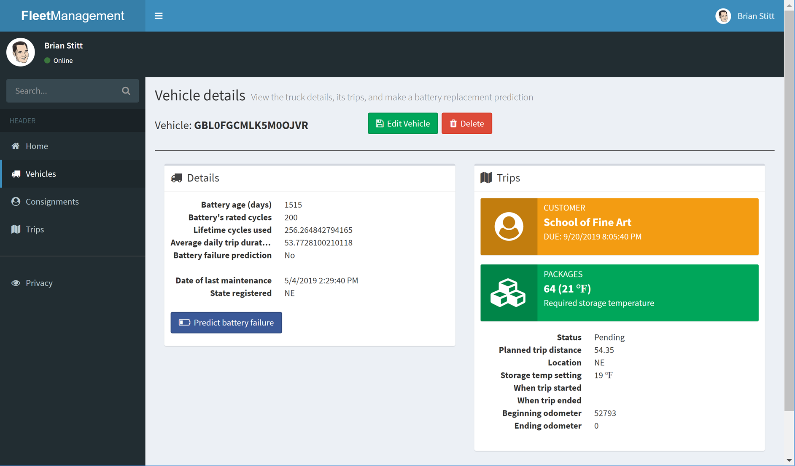
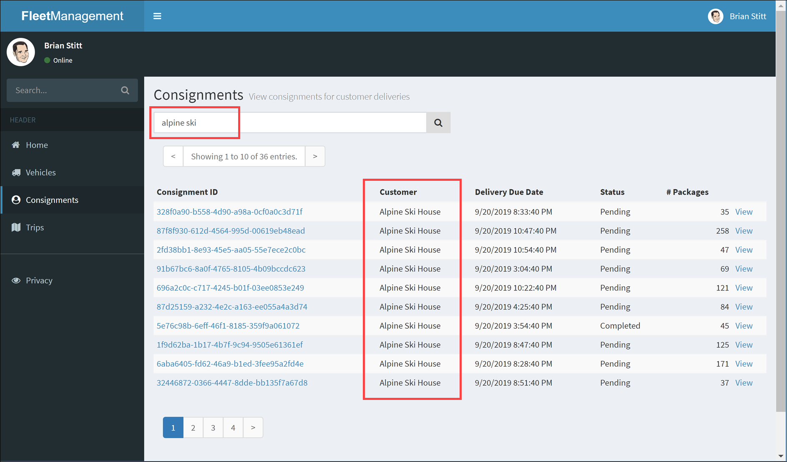

## Exercise 6: Observe data using Cosmos DB Data Explorer and Web App

**Duration**: 10 minutes

<summary><strong><em>Table of Contents</em></strong></summary>
<!-- TOC -->
- [Task 1: View data in Cosmos DB Data Explorer](#task-1-view-data-in-cosmos-db-data-explorer)
- [Task 2: Search and view data in Web App](#task-2-search-and-view-data-in-web-app)
<!-- /TOC -->

### Task 1: View data in Cosmos DB Data Explorer

1. In the Azure portal (<https://portal.azure.com>), open the Cosmos DB instance within your **cosmos-db-iot** resource group.

2. Select **Data Explorer** in the left-hand menu.

3. Expand the **ContosoAuto** database, then expand the **metadata** container. Select **Items** to view a list of documents stored in the container. Select one of the items to view the data.

    

4. Select the ellipsis (...) to the right of the **metadata** container name, then select **New SQL Query**.

    

5. Replace the query with the following:

    ```sql
    SELECT * FROM c WHERE c.entityType = 'Vehicle'
    ```

6. Execute the query to view the first 100 vehicle records.

    

7. Update the query to find trip records where the trip is completed.

    ```sql
    SELECT * FROM c WHERE c.entityType = 'Trip' AND c.status = 'Completed'
    ```

    

    Please note, you may not have any trips that have completed yet. Try querying where the `status` = **Active** instead. Active trips are those that are currently running.

    Here is an example completed trip record (several packages removed for brevity):

    ```json
    {
        "partitionKey": "DK6JW0RNF0G9PO2FJ",
        "id": "eb96c44e-4c1d-4f54-bdea-e7d2f927009c",
        "entityType": "Trip",
        "vin": "DK6JW0RNF0G9PO2FJ",
        "consignmentId": "e1da2e74-bf37-4773-a5bf-483fc08533ac",
        "plannedTripDistance": 18.33,
        "location": "AR",
        "odometerBegin": 106841,
        "odometerEnd": 106859.36,
        "temperatureSetting": 19,
        "tripStarted": "2019-09-20T14:39:24.1855725Z",
        "tripEnded": "2019-09-20T14:54:53.7558481Z",
        "status": "Completed",
        "timestamp": "0001-01-01T00:00:00",
        "packages": [
            {
                "packageId": "a5651f48-67d5-4c1b-b7d9-80d678aabe9b",
                "storageTemperature": 30,
                "highValue": false
            },
            {
                "packageId": "b2185628-eb0e-49b9-8b7d-685fcdcb5a36",
                "storageTemperature": 22,
                "highValue": false
            },
            {
                "packageId": "25ac4bd1-5aad-4030-91f7-9539cc15b441",
                "storageTemperature": 31,
                "highValue": true
            }
        ],
        "consignment": {
            "consignmentId": "e1da2e74-bf37-4773-a5bf-483fc08533ac",
            "customer": "Fabrikam, Inc.",
            "deliveryDueDate": "2019-09-20T17:50:40.3291024Z"
        },
        "_rid": "hM5HAOavCggb5QAAAAAAAA==",
        "_self": "dbs/hM5HAA==/colls/hM5HAOavCgg=/docs/hM5HAOavCggb5QAAAAAAAA==/",
        "_etag": "\"2d0364cc-0000-0700-0000-5d84e83d0000\"",
        "_attachments": "attachments/",
        "_ts": 1568991293
    }
    ```

    Portions of the package and consignment records are included since they are often used in trip queries and reports.

### Task 2: Search and view data in Web App

1. Navigate to your deployed Fleet Management web app. If you closed it earlier, you can find the deployment URL in the Overview blade of your Web App (**IoTWebApp**) in the portal.

    

2. Select **Vehicles**. Here you will see the paging capabilities at work.

    

3. Select one of the vehicles to view the details. On the right-hand side of the details page are the trips assigned to the vehicle. This view provides the customer name from the associated consignment record, aggregate information for the packages, and the trip details.

    

4. Go back to the vehicles list and enter a search term, such as **MT**. This will search both the state registered, and the VIN, including partial matches. Feel free to search for both states and VINs. In the screenshot below, we searched for `MT` and received results for Montana state registrations, and had a record where `MT` was included in the VIN.

    

5. Select **Consignments** in the left-hand menu, then enter **alpine ski** in the search box and execute. You should see several consignments for the `Alpine Ski House` customer. You can also search by Consignment ID. In our results, one of the consignments has a status of Completed.

    

6. Select a consignment to view the details. The record shows the customer, delivery due date, status, and package details. The package statistics contains aggregates to calculate the total number of packages, the required storage temperature, based on the package with the lowest storage temperature setting, the total cubic feet and combined gross weight of the packages, and whether any of the packages are considered high value.

    

7. Select **Trips** in the left-hand menu. Use the filter at the top of the page to filter trips by status, such as Pending, Active, Delayed, and Completed. Trips are delayed if the status is not Completed prior to the delivery due date. You may not see any delayed at this point, but you may have some that become delayed when you re-run the data generator later. You can view the Vehicle or related Consignment record from this page.

    

[Return to Table of Contents to continue Lab](./README.md)
