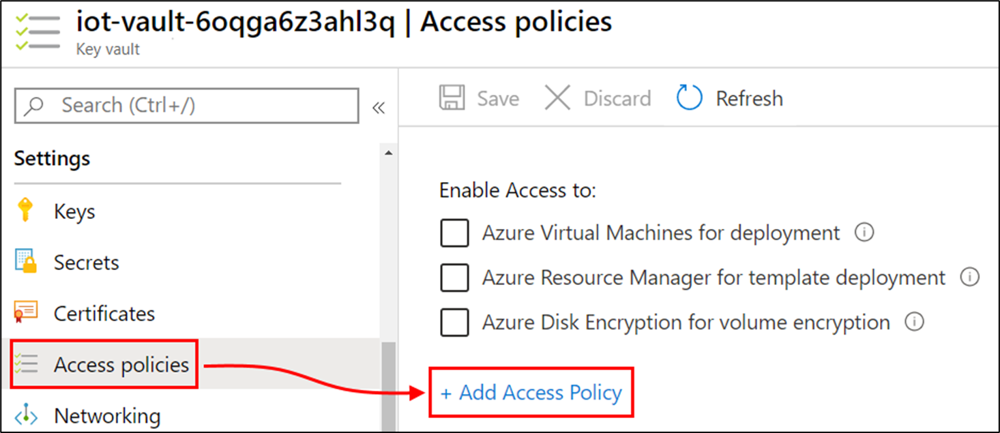
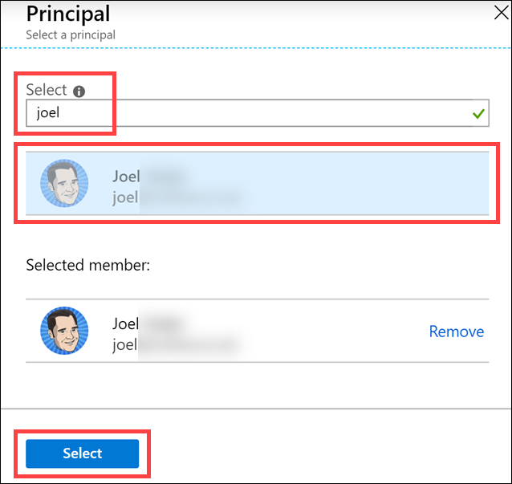
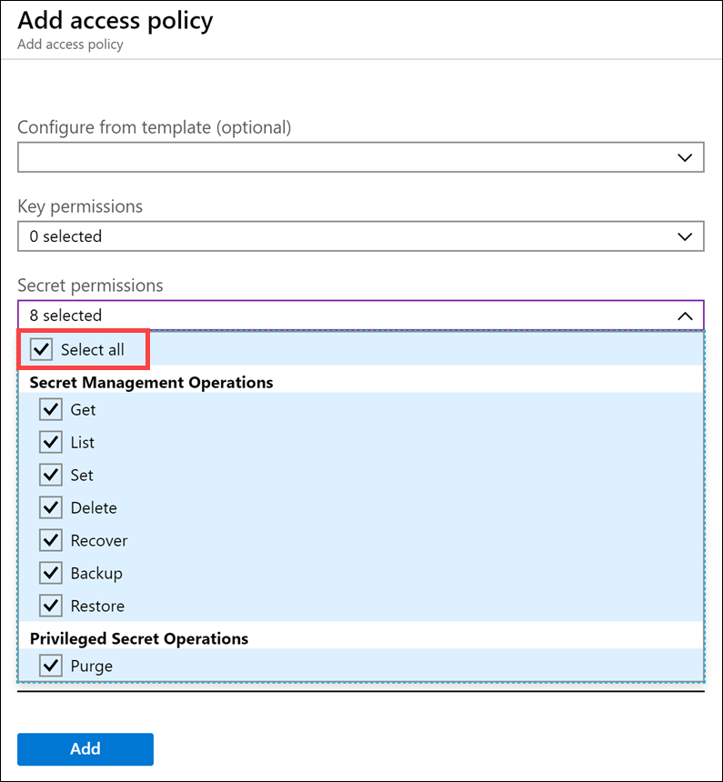

# Cosmos DB scenario-based labs - IoT

## 2. Configure environment

**Duration**: 5 minutes

<!-- TOC -->
- [Task 1: Authenticate the Office 365 API connection for sending email alerts](#task-2-authenticate-the-office-365-api-connection-for-sending-email-alerts)
- [Task 2: Add your user account to Key Vault access policy](#task-2-add-your-user-account-to-key-vault-access-policy)
<!-- /TOC -->

## Task 1: Authenticate the Office 365 API Connection for sending email alerts

In this task, you will open the deployed Logic App workflow and configure it to send email alerts through its HTTP trigger. This trigger will be called by one of your Azure functions that gets triggered by the Cosmos DB change feed, any time a notification event occurs, such as completing a trip. You will need to have an Office 365 or Outlook.com account to send the emails.

1. In the [Azure portal](https://portal.azure.com), navigate to your resource group for this demo and open the **Logic App**.

2. Select **API connections** in the left-hand menu, then select the **office365** API connection.

    

3. In the API connection window, select **Edit API connection** in the left-hand menu, then select **Authorize**.

    

4. Authenticate using the account you used to deploy the demo in Setup task 3, "Run deployment scripts".

    

5. When a message is displayed that Authorization was successful, select **Save**. After a few seconds, a notification will confirm API connection save.

    

    

Return to your demo resource group to continue with the next steps.

## Task 2: Add your user account to Key Vault access policy

Perform these steps to create an access policy for your user account so you can manage secrets. Since we created Key Vault with a template, your account was not automatically added to the access policies.

1. Within Key Vault, select **Access policies** in the left-hand menu.

2. Select **+ Add Access Policy**.

   

3. Select the **Select principal** section on the Add access policy form.

   

4. In the Principal blade, search for the Azure account you are using for this lab, select it, then select the **Select** button.

   

5. Expand the **Secret permissions** and check **Select all** under Secret Management Operations. All 8 should be selected.

   

6. Select **Add** to add the new access policy.. When you are done, you should have an access policy for your user account. Select **Save** to save your new access policy.

    

**This completes the demo environment configuration tasks.**

[Return to Table of Contents to continue](./README.md)
