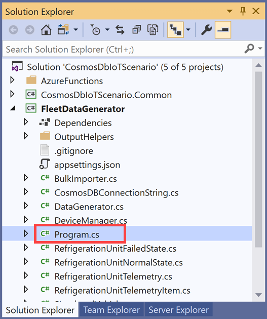
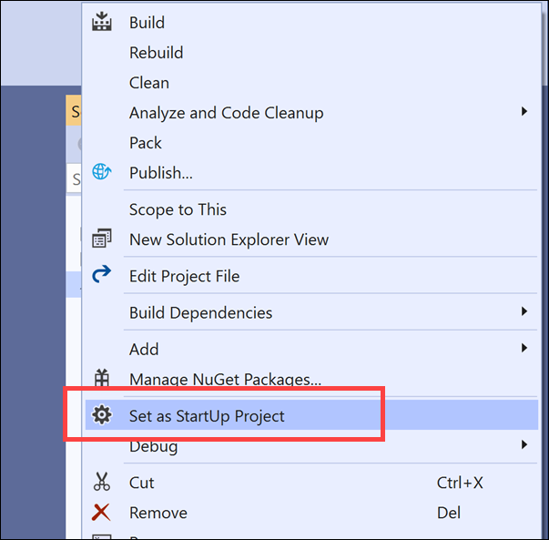
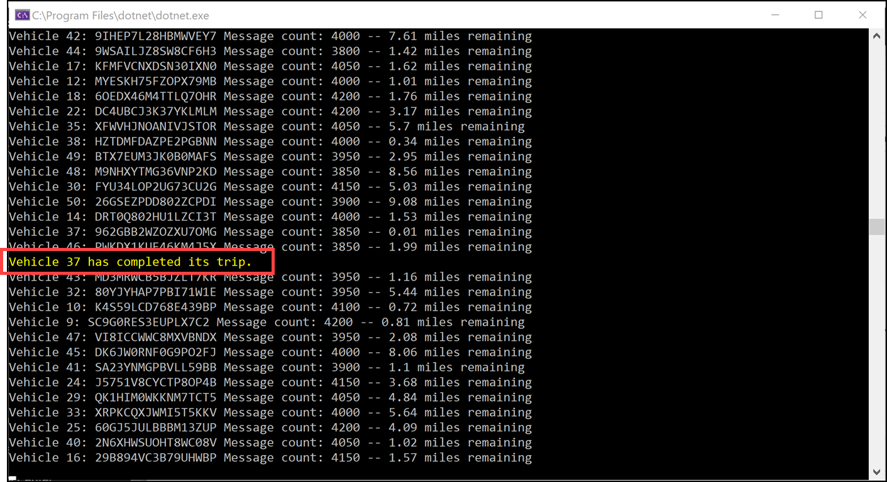
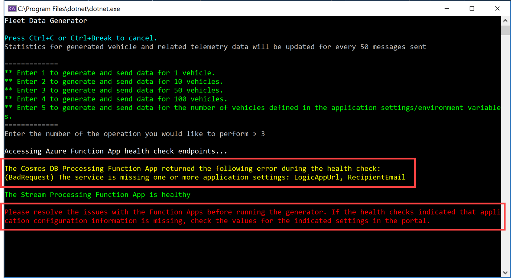

## Exercise 4: Explore and run the Data Generator

**Duration**: 10 minutes

<summary><strong><em>Table of Contents</em></strong></summary>
<!-- TOC -->
- [Task 1: Open the data generator project](#task-1-open-the-data-generator-project)
- [Task 2: Code walk-through](#task-2-code-walk-through)
- [Task 3: Update application configuration](#task-3-update-application-configuration)
- [Task 4: Run generator](#task-4-run-generator)
- [Task 5: View devices in IoT Hub](#task-5-view-devices-in-iot-hub)
<!-- /TOC -->

In this exercise, we will explore the data generator project, **FleetDataGenerator**, update the application configuration, and run it in order to seed the metadata database with data and simulate a single vehicle.

There are several tasks that the data generator performs, depending on the state of your environment. The first task is that the generator will create the Cosmos DB database and containers with the optimal configuration for this lab if these elements do not exist in your Cosmos DB account. When you run the generator in a few moments, this step will be skipped because you already created them at the beginning of the lab. The second task the generator performs is to seed your Cosmos DB `metadata` container with data if no data exists. This includes vehicle, consignment, package, and trip data. Before seeding the container with data, the generator temporarily increases the requested RU/s for the container to 50,000 for optimal data ingestion speed. After the seeding process completes, the RU/s are scaled back down to 15,000.

After the generator ensures the metadata exists, it begins simulating the specified number of vehicles. You are prompted to enter a number between 1 and 5, simulating 1, 10, 50, 100, or the number of vehicles specified in your configuration settings, respectively. For each simulated vehicle, the following tasks take place:

1. An IoT device is registered for the vehicle, using the IoT Hub connection string and setting the device ID to the vehicle's VIN. This returns a generated device key.
2. A new simulated vehicle instance (`SimulatedVehicle`) is added to a collection of simulated vehicles, each acting as an AMQP device and assigned a Trip record to simulate the delivery of packages for a consignment. These vehicles are randomly selected to have their refrigeration units fail and, out of those, some will randomly fail immediately while the others fail gradually.
3. The simulated vehicle creates its own AMQP device instance, connecting to IoT Hub with its unique device ID (VIN) and generated device key.
4. The simulated vehicle asynchronously sends vehicle telemetry information through its connection to IoT Hub continuously until it either completes the trip by reaching the distance in miles established by the Trip record, or receiving a cancellation token.

### Task 1: Open the data generator project

1. If the Visual Studio solution is not already open, navigate to the location where you saved the code and into the **Starter** folder, then open the Visual Studio solution file: **CosmosDbIoTScenario.sln**.

2. Expand the **FleetDataGenerator** project and open **Program.cs** in the Solution Explorer.

    

### Task 2: Code walk-through

There is a lot of code within the data generator project, so we'll just touch on the highlights. The code we do not cover is commented and should be easy to follow if you so desire.

1. Within the **Main** method of **Program.cs**, the core workflow of the data generator is executed by the following code block:

    ```csharp
    // Instantiate Cosmos DB client and start sending messages:
    using (_cosmosDbClient = new CosmosClient(cosmosDbConnectionString.ServiceEndpoint.OriginalString,
        cosmosDbConnectionString.AuthKey, connectionPolicy))
    {
        await InitializeCosmosDb();

        // Find and output the container details, including # of RU/s.
        var container = _database.GetContainer(MetadataContainerName);

        var offer = await container.ReadThroughputAsync(cancellationToken);

        if (offer != null)
        {
            var currentCollectionThroughput = offer ?? 0;
            WriteLineInColor(
                $"Found collection `{MetadataContainerName}` with {currentCollectionThroughput} RU/s.",
                ConsoleColor.Green);
        }

        // Initially seed the Cosmos DB database with metadata if empty.
        await SeedDatabase(cosmosDbConnectionString, cancellationToken);
        trips = await GetTripsFromDatabase(numberSimulatedTrucks, container);
    }

    try
    {
        // Start sending telemetry from simulated vehicles to Event Hubs:
        _runningVehicleTasks = await SetupVehicleTelemetryRunTasks(numberSimulatedTrucks,
            trips, arguments.IoTHubConnectionString);
        var tasks = _runningVehicleTasks.Select(t => t.Value).ToList();
        while (tasks.Count > 0)
        {
            try
            {
                Task.WhenAll(tasks).Wait(cancellationToken);
            }
            catch (TaskCanceledException)
            {
                //expected
            }

            tasks = _runningVehicleTasks.Where(t => !t.Value.IsCompleted).Select(t => t.Value).ToList();

        }
    }
    catch (OperationCanceledException)
    {
        Console.WriteLine("The vehicle telemetry operation was canceled.");
        // No need to throw, as this was expected.
    }
    ```

    The top section of the code instantiates a new `CosmosClient`, using the connection string defined in either `appsettings.json` or the environment variables. The first call within the block is to `InitializeCosmosDb()`. We'll dig into this method in a moment, but it is responsible for creating the Cosmos DB database and containers if they do not exist in the Cosmos DB account. Next, we create a new `Container` instance, which the v3 version of the .NET Cosmos DB SDK uses for operations against a container, such as CRUD and maintenance information. For example, we call `ReadThroughputAsync` on the container to retrieve the current throughput (RU/s), and we pass it to `GetTripsFromDatabase` to read Trip documents from the container, based on the number of vehicles we are simulating. In this method, we also call the `SeedDatabase` method, which checks whether data currently exists and, if not, calls methods in the `DataGenerator` class (`DataGenerator.cs` file) to generate vehicles, consignments, packages, and trips, then writes the data in bulk using the `BulkImporter` class (`BulkImporter.cs` file). This `SeedDatabase` method executes the following on the `Container` instance to adjust the throughput (RU/s) to 50,000 before the bulk import, and back to 15,000 after the data seeding is complete: `await container.ReplaceThroughputAsync(desiredThroughput);`.

    The `try/catch` block calls `SetupVehicleTelemetryRunTasks` to register IoT device instances for each simulated vehicle and load up the tasks from each `SimulatedVehicle` instance it creates. It uses `Task.WhenAll` to ensure all pending tasks (simulated vehicle trips) are complete, removing completed tasks from the `_runningvehicleTasks` list as they finish. The cancellation token is used to cancel all running tasks if you issue the cancel command (`Ctrl+C` or `Ctrl+Break`) in the console.

2. Scroll down the `Program.cs` file until you find the `InitializeCosmosDb()` method. Here is the code for your reference:

    ```csharp
    private static async Task InitializeCosmosDb()
    {
        _database = await _cosmosDbClient.CreateDatabaseIfNotExistsAsync(DatabaseName);

        #region Telemetry container
        // Define a new container.
        var telemetryContainerDefinition =
            new ContainerProperties(id: TelemetryContainerName, partitionKeyPath: $"/{PartitionKey}")
            {
                IndexingPolicy = { IndexingMode = IndexingMode.Consistent }
            };

        // Tune the indexing policy for write-heavy workloads by only including regularly queried paths.
        // Be careful when using an opt-in policy as we are below. Excluding all and only including certain paths removes
        // Cosmos DB's ability to proactively add new properties to the index.
        telemetryContainerDefinition.IndexingPolicy.ExcludedPaths.Clear();
        telemetryContainerDefinition.IndexingPolicy.ExcludedPaths.Add(new ExcludedPath { Path = "/*" }); // Exclude all paths.
        telemetryContainerDefinition.IndexingPolicy.IncludedPaths.Clear();
        telemetryContainerDefinition.IndexingPolicy.IncludedPaths.Add(new IncludedPath { Path = "/vin/?" });
        telemetryContainerDefinition.IndexingPolicy.IncludedPaths.Add(new IncludedPath { Path = "/state/?" });
        telemetryContainerDefinition.IndexingPolicy.IncludedPaths.Add(new IncludedPath { Path = "/partitionKey/?" });

        // Create the container with a throughput of 15000 RU/s.
        await _database.CreateContainerIfNotExistsAsync(telemetryContainerDefinition, throughput: 15000);
        #endregion

        #region Metadata container
        // Define a new container (collection).
        var metadataContainerDefinition =
            new ContainerProperties(id: MetadataContainerName, partitionKeyPath: $"/{PartitionKey}")
            {
                // Set the indexing policy to consistent and use the default settings because we expect read-heavy workloads in this container (includes all paths (/*) with all range indexes).
                // Indexing all paths when you have write-heavy workloads may impact performance and cost more RU/s than desired.
                IndexingPolicy = { IndexingMode = IndexingMode.Consistent }
            };

        // Set initial performance to 50,000 RU/s for bulk import performance.
        await _database.CreateContainerIfNotExistsAsync(metadataContainerDefinition, throughput: 50000);
        #endregion

        #region Maintenance container
        // Define a new container (collection).
        var maintenanceContainerDefinition =
            new ContainerProperties(id: MaintenanceContainerName, partitionKeyPath: $"/vin")
            {
                IndexingPolicy = { IndexingMode = IndexingMode.Consistent }
            };

        // Set initial performance to 400 RU/s due to light workloads.
        await _database.CreateContainerIfNotExistsAsync(maintenanceContainerDefinition, throughput: 400);
        #endregion
    }
    ```

    This method creates a Cosmos DB database if it does not already exist, otherwise it retrieves a reference to it (`await _cosmosDbClient.CreateDatabaseIfNotExistsAsync(DatabaseName);`). Then it creates `ContainerProperties` for the `telemetry`, `metadata`, and `maintenance` containers. The `ContainerProperties` object lets us specify the container's indexing policy. We use the default indexing policy for `metadata` and `maintenance` since they are read-heavy and benefit from a greater number of paths, but we exclude all paths in the `telemetry` index policy, and add paths only to those properties we need to query, due to the container's write-heavy workload. The `telemetry` container is assigned a throughput of 15,000 RU/s, 50,000 for `metadata` for the initial bulk import, then it is scaled down to 15,000, and 400 for `maintenance`.

### Task 3: Update application configuration

The data generator needs two connection strings before it can successfully run; the IoT Hub connection string, and the Cosmos DB connection string. The IoT Hub connection string can be found by selecting **Shared access policies** in IoT Hub, selecting the **iothubowner** policy, then copying the **Connection string--primary key** value. This is different from the Event Hub-compatible endpoint connection string you copied earlier.


1. Open **appsettings.json** within the **FleetDataGenerator** project.

2. Paste the IoT Hub connection string value in quotes next to the **IOT_HUB_CONNECTION_STRING** key. Paste the Cosmos DB connection string value in quotes next to the **COSMOS_DB_CONNECTION_STRING** key.

3. The data generator also requires the Health Check URLs you copied in the previous exercise for the `HealthCheck` functions located in both Function Apps. Paste the Cosmos DB Processing Function App's `HealthCheck` function's URL in quotes next to the **COSMOS_PROCESSING_FUNCTION_HEALTHCHECK_URL** key. Paste the Stream Processing Function App's `HealthCheck` function's URL in quotes next to the **STREAM_PROCESSING_FUNCTION_HEALTHCHECK_URL** key.

    

    The NUMBER_SIMULATED_TRUCKS value is used when you select option 5 when you run the generator. This gives you the flexibility to simulate between 1 and 1,000 trucks at a time. SECONDS_TO_LEAD specifies how many seconds to wait until the generator starts generating simulated data. The default value is 0. SECONDS_TO_RUN forces the simulated trucks to stop sending generated data to IoT Hub. The default value is 14400. Otherwise, the generator stops sending tasks when all the trips complete or you cancel by entering `Ctrl+C` or `Ctrl+Break` in the console window.

3. **Save** the `appsettings.json` file.

> As an alternative, you may save these settings as environment variables on your machine, or through the FleetDataGenerator properties. Doing this will remove the risk of accidentally saving your secrets to source control.

### Task 4: Run generator

In this task, you will run the generator and have it generate events for 50 trucks. The reason we are generating events for so many vehicles is two-fold:

   - In the next exercise, we will observe the function triggers and event activities with Application Insights.
   - We need to have completed trips prior to performing batch predictions in a later exercise.

> **Warning**: You will receive a lot of emails when the generator starts sending vehicle telemetry. If you do not wish to receive emails, simply disable the Logic App you created.

1. Within Visual Studio, right-click on the **FleetDataGenerator** project in the Solution Explorer and select **Set as Startup Project**. This will automatically run the data generator each time you debug.

    

2. Select the Debug button at the top of the Visual Studio window or hit **F5** to run the data generator.

    

3. When the console window appears, enter **3** to simulate 50 vehicles. The generator will perform the Function App health checks, resize the requested throughput for the `metadata` container, use the bulk importer to seed the container, and resize the throughput back to 15,000 RU/s.

    

4. After the seeding is completed the generator will retrieve 50 trips from the database, sorted by shortest trip distance first so we can have completed trip data appear faster. You will see a message output for every 50 events sent, per vehicle with their VIN, the message count, and the number of miles remaining for the trip. For example: `Vehicle 19: C1OVHZ8ILU8TGGPD8 Message count: 3650 -- 3.22 miles remaining`. **Let the generator run in the background and continue to the next exercise**.

    

5. As the vehicles complete their trips, you will see a message such as `Vehicle 37 has completed its trip`.

    

6. When the generator completes, you will see a message to this effect.

    

If the health checks fail for the Function Apps, the data generator will display a warning, oftentimes telling you which application settings are missing. The data generator will not run until the health checks pass. Refer to Exercise 3, Task 2 above for tips on troubleshooting the application settings.



### Task 5: View devices in IoT Hub

The data generator registered and activated each simulated vehicle in IoT Hub as a device. In this task, you will open IoT Hub and view these registered devices.

1. In the Azure portal (<https://portal.azure.com>), open the IoT Hub instance within your **cosmos-db-iot** resource group.

    

2. Select **IoT devices** in the left-hand menu. You will see all 50 IoT devices listed in the IoT devices pane to the right, with the VIN specified as the device ID. When we simulate more vehicles, we will see additional IoT devices registered here.

    

[Return to Table of Contents to continue](./README.md)
