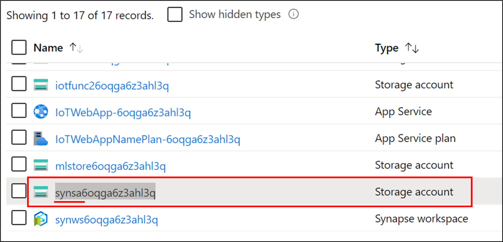
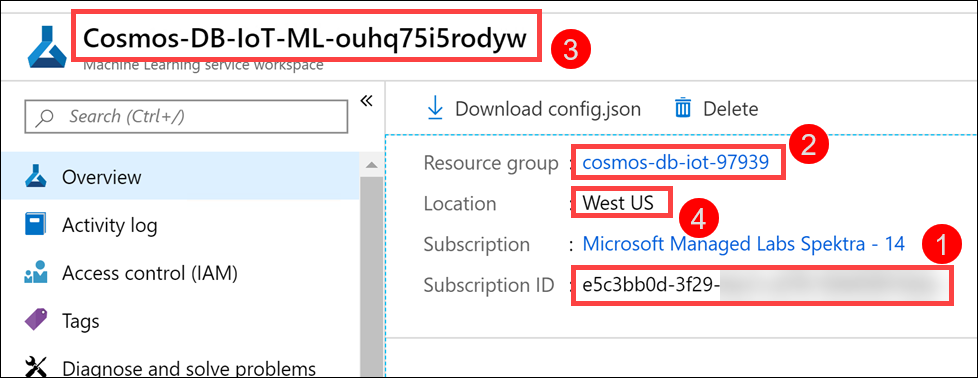

# Cosmos DB scenario-based labs - IoT

## 11. Run the predictive maintenance batch scoring model

**Duration**: 20 minutes

<!-- TOC -->
- [Task 1: Enable Data Lake Storage Access for your account](#task-1-enable-data-lake-storage-access-for-your-account)
- [Task 2: Connect Azure Synapse to Azure Cosmos DB](#task-2-connect-azure-synapse-to-azure-cosmos-db)
- [Task 3: Import lab notebooks into Azure Synapse Workspace](#task-3-import-lab-notebooks-into-azure-synapse-workspace)
- [Task 4: Run batch scoring notebook](#task-4-run-batch-scoring-notebook)
<!-- /TOC -->

In this set of tasks, you will connect Azure Synapse to your Azure Cosmos DB account, then you will import two Synapse notebooks into your Azure Synapse workspace. A notebook is interactive and runs in any web browser, mixing markup (formatted text with instructions), executable code, and outputs from running the code.

Next, you will run the Batch Scoring notebook to make battery failure predictions on vehicles, using vehicle and trip data stored in Cosmos DB.

### Task 1: Enable Data Lake Storage Access for your account

We need to grant your account access to the Storage Account used by Synapse Workspace so that you can interactively run Synapse Spark notebooks.

Start in your Resource Group. Select the Storage Account that was deployed for the Synapse Workspace. Its name will begin with "synsa". Be careful to select the correct Storage Account!

In the Storage Account, navigate to the **Access control (IAM)** blade. Then select **Role Assignments**. Then click **+ Add**.

On the **+ Add** dropdown, select **Add role assignment**.

On the **Add role assignment** blade, set **Role** to **Storage Blob Data Contributor**. Then enter the username with which you logged Azure into the **Select** field. Select it from the results area, then select **Save**.

After the Role Assignment is successfully saved, return to your Resource Group.

### Launch Azure Synapse Studio

1. In the [Azure portal](https://portal.azure.com), open your resource group, then open your **Azure Synapse workspace**. There should be one Synapse Workspace resource and its name should start with **synws**.

   

2. From the Overview section, click on the Workspace web URL. Azure Synapse will automatically sign you in through its Azure Active Directory integration.

   

### Task 2: Connect Azure Synapse to Azure Cosmos DB

In this task, you will create a linked service connection from Azure Synapse to Azure Cosmos DB.

1. In Synapse Studio, select **Data**, then select the **Linked** tab. Select **+**, then select **Connect to external data**.

   

2. Select **Azure Cosmos DB (SQL API)**,then select **Continue**.

   

3. Provide connection information.
   1. Enter **CosmosDbIoTLab** for the linked service name (IMPORTANT - enter this exactly, it is used elsewhere).
   2. For **Account selection method**, select **From Azure subscription**.
   3. For **Azure subscription**, select the Azure subscription in which you deployed the lab/demo resources.
   4. For **Cosmos DB account name**, select the Azure Cosmos DB account you deployed for this lab/demo.
   5. For **Database name**, select **ContosoAuto**.
   6. Next, select **Test connection**. Ensure that **Connection successful** is shown. If an error is shown, correct the previous settings.
   7. Select **Create**.

   

4. Observe the notification that the linked service connection was saved successfully.

   

### Task 3: Import lab notebooks into Azure Synapse Workspace

In this task, you will import the Synapse notebooks into your workspace.

1. Select **Develop**, select **+**, then select Import.

   

2. Navigate to your **deploy** folder and select the file called **Batch_Scoring.ipynb**, then select **Open**.

   

    Repeat the process for the file called **Model_Deployment.ipynb**. You will use this file later.

3. After importing, you will see the two new notebooks under the **Notebooks** section.

### Task 4: Run batch scoring notebook

In this task, you will run the `Batch_Scoring` notebook, using a pre-trained machine learning (ML) model to determine if the battery needs to be replaced on several vehicles within the next 30 days.

The code leverages the [Azure Cosmos DB Analytical Store](https://docs.microsoft.com/azure/cosmos-db/analytical-store-introduction). This allows the Spark pool to read the data directly from Cosmos DB analytical storage, and does not impact Cosmos DB transactional throughput or use provisioned Request Units (RUs). It also gives us the ability to join data across containers.

The notebook performs the following actions:

1. Downloads a pre-trained ML model, saves it to Azure ML, then uses that model for batch scoring.
2. Uses the Cosmos DB Analytical Store connector to retrieve completed Trips and Vehicle metadata from the `metadata` Cosmos DB analytical container, prepares the data using SQL queries, then surfaces the data as temporary views.
3. Applies predictions against the data, using the pre-trained model.
4. Uses the Cosmos DB Spark connector to save the prediction results back into the Cosmos DB `maintenance` container for reporting purposes.

To run this notebook, perform the following steps:

1. Select the **Batch_Scoring** notebook to open it.

   

1. Before you can execute the cells in this or the other notebooks for this lab, you must first attach it to a Spark pool cluster. Expand the dropdown at the top of the notebook where you see **Attach to** and select your Spark pool. Make sure to select PySpark as Language.

   

1. You may use keyboard shortcuts to execute the cells, such as **Ctrl+Enter** to execute the current cell, or **Shift+Enter** to execute a cell and move to the next one below.

In both notebooks, you will be required to provide values for your Machine Learning service workspace. You can find these values within the Overview blade of your Machine Learning service workspace that is located in your lab resource group.

The values highlighted in the screenshot below are for the following variables in the notebooks:

1. `subscription_id`
1. `resource_group`
1. `workspace_name`
1. `workspace_region`

> If you wish to execute this notebook on a scheduled basis, such as every evening, you can add the Notebook to an existing or new **Pipeline**.

[Return to Table of Contents to continue](./README.md)
